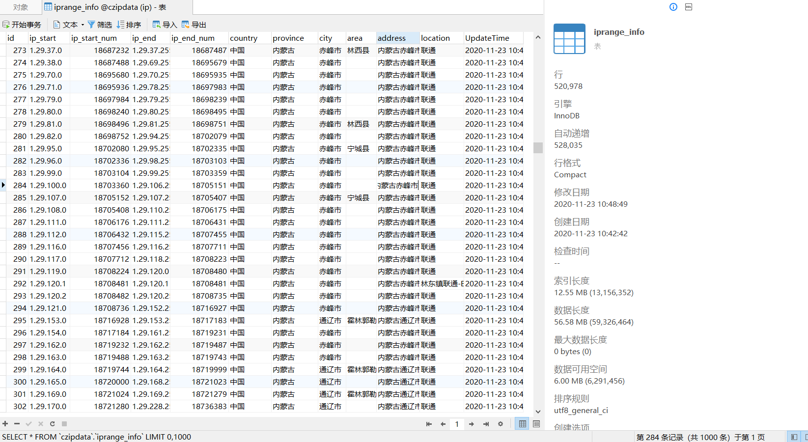
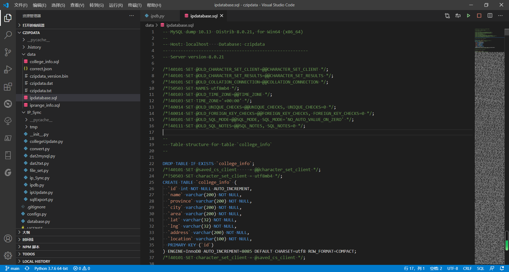
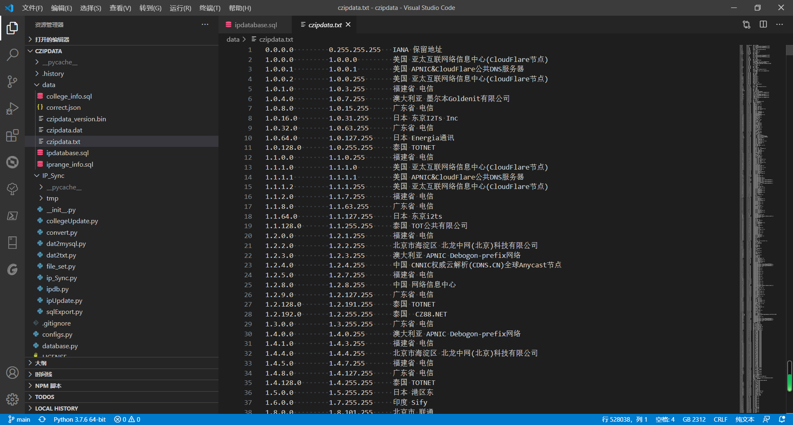
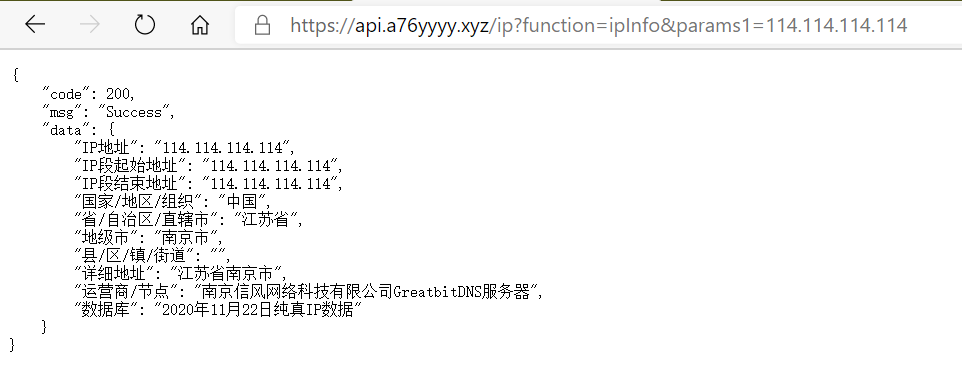

# czipdata

 

 
 

纯真IP数据库镜像及mysql同步更新 for Python

Github：[https://github.com/a76yyyy/czipdata](https://github.com/a76yyyy/czipdata)

Gitee ：[https://gitee.com/a76yyyy/czipdata](https://gitee.com/a76yyyy/czipdata)

# 功能

1. 通过Python实现纯真IP数据库的镜像更新，数据库在data文件夹下；
2. 将数据文件解析为txt格式；
3. 将数据文件全量导入mysql中；
4. 将mysql数据库中的IP数据库内的地址细分为省市区；
5. 生成sql脚本文件；
6. 使用BAT文件实现数据库的自动更新和推送；
7. 结合计划任务可实现windows的定时更新。

# 数据文件

文件 | 内容
---|:---
czipdata_version.bin|本地数据文件版本记录
czipdata.dat|纯真IP数据文件
czipdata.txt|纯真IP数据TXT文件
correct.json|地址细分纠错文件
ipdatabase.sql|IP数据库sql脚本
college_info.sql|高校信息表sql脚本
iprange_info.sql|IP数据表sql脚本

# TODO

1. 将数据文件导入sqlite3数据库db文件中；
2. 实现数据库的增量更新；
3. 实现Linux定时更新；
4. ipv6数据库。

# 图片

示例API接口(暂不提供源码):[https://api.a76yyyy.xyz/ip?function=ipInfo&params1=114.114.114.114](https://api.a76yyyy.xyz/ip?function=ipInfo&params1=114.114.114.114)

